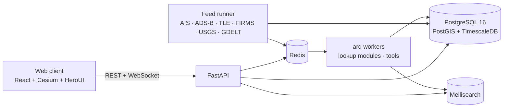

# OSINT Board

A self-hostable (or cloud-hosted) open-source-intelligence workbench built around a **true-scale 3D Earth**.
Every module in [`catalog/osint-modules.csv`](catalog/osint-modules.csv) — 239 sources, from threat feeds to
live vessel and aircraft tracking — is modelled in one catalog, wired through one module framework, and
everything with a location lands on the globe in the right place, at the right precision, with layer toggles
and colour coding. A fast, type-aware search box is the entry point to every investigation.

> Status: **phase 1 in progress**. The architecture, catalog, documentation, deployment files and the core code
> paths are in place and tested; every free API in the catalog that still exists is wired up (108 modules with
> offline fixture tests, including the AIS, GDELT, OpenCellID and Tor feeds), and the remaining internal and
> tiered replacements follow the phases described in [docs/09-roadmap.md](docs/09-roadmap.md).

## What it does

| Area | Summary |
|---|---|
| **Globe** | CesiumJS on the WGS84 ellipsoid, vertical exaggeration pinned to 1, aircraft at true altitude, satellites propagated with SGP4 at true orbital height. No Cesium ion account needed (bundled offline imagery, optional self-hosted tiles). |
| **Layers** | 18 layers (maritime, aviation, space, fires, seismic, conflict, news, weather, cell towers, Wi-Fi, Tor, cloud regions, infrastructure, threat, social, corporate, media, investigation), each with a base colour and an attribute-driven colour scale. Low-precision placements render as uncertainty halos, never pins. |
| **Modules** | One catalog (`catalog/modules.yaml`) describes all 239 sources: what they consume/produce, whether they emit geo data, their verified access model, and — for every tiered/commercial API — the internal service that replaces it. |
| **Search** | A parser classifies what you typed (IP, CIDR, domain, e-mail, hash, BTC/ETH, IBAN, LEI, phone, MMSI, ICAO24, NORAD, coordinates, CVE, BSSID and more) with checksum validation, understands filters, fans out to exact plus typo-tolerant plus live-track lookups, and suggests the next pivot or module to run. |
| **Free first, internal second** | Phase 1 wires the 104 free APIs; phases 3–4 replace the 81 tiered/commercial APIs with 24 internal services designed to match or exceed them on quality and freshness (see [docs/07-internal-replacements.md](docs/07-internal-replacements.md)). |
| **Deploy anywhere** | `docker compose up` for self-hosting; a Helm chart for Kubernetes with managed Postgres/Redis/Meilisearch. |

## Architecture at a glance



Details: [docs/01-architecture.md](docs/01-architecture.md).

## Quick start

```bash
cp .env.example .env                      # add any free API keys you have (everything runs without them)
docker compose up -d --build              # db, redis, meilisearch, api, worker, feeds, web
open http://localhost:8080                # globe; API docs at http://localhost:8000/api/docs
```

Local development:

```bash
make infra                 # postgres + redis + meilisearch in docker
make backend-install       # uv sync (Python 3.11+)
make migrate api           # API on :8000 with reload
make frontend-install frontend-dev        # Vite on :5173, proxies /api
make feeds                 # start the free geo feeds (USGS works with no key at all)
make check                 # everything CI runs
```

## Repository layout

```
catalog/     modules.yaml (239 modules) · layers.yaml · services.yaml · entities.yaml · the original CSV
backend/     osint_board: api · modules (framework + implementations) · feeds · worker · search · geo · db
frontend/    React 19 + Vite + CesiumJS + HeroUI v3 client
deploy/      Dockerfiles, nginx, Helm chart, SearXNG config
docs/        scope, architecture, data model, module framework, feeds, globe, search, replacements,
             deployment, roadmap, security/legal, ADRs, generated module catalog
scripts/     catalog.py — validate / generate docs / scaffold module stubs
```

## Documentation

Start at [docs/README.md](docs/README.md). The generated per-module reference is
[docs/modules/CATALOG.md](docs/modules/CATALOG.md).

## Module inventory (from the CSV)

| Type | Count | Plan |
|---|---|---|
| Free API | 104 | Phase 1 — wire directly (12 are retired upstream and fold into internal services) |
| Internal | 41 | Phases 1–2 — build in-process |
| Tool | 13 | Phase 2 — run in the `tools` worker image |
| Tiered API | 70 | Phase 3 — internal replacement services |
| Commercial API | 11 | Phase 4 — internal replacement services |

## License

Not yet chosen — see the note in [CONTRIBUTING.md](CONTRIBUTING.md).
