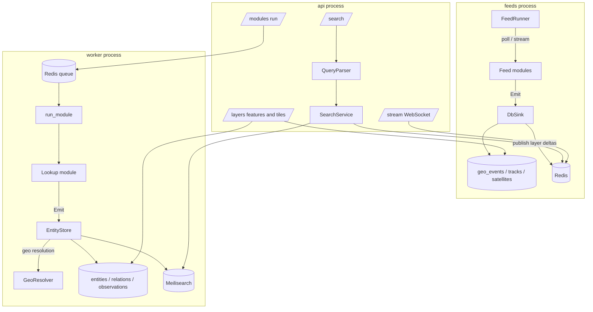

# 01 — Architecture

## Components

| Component | Runs as | Responsibility |
|---|---|---|
| **Web client** | static files (nginx) | Cesium globe, layer panel, search, inspector. Talks only to `/api`. |
| **API** | `osint-board api` (uvicorn) | Catalog, search, layer features/tiles, module runs, investigations, WebSocket stream. |
| **Feed runner** | `osint-board feeds` (singleton) | Polls/streams every implemented feed module on its cadence, writes geo tables, publishes deltas. |
| **Workers** | `osint-board worker [--queue tools]` | Executes lookup modules on demand (arq/Redis). The `tools` queue runs in the tools image with nmap, nuclei and similar. |
| **PostgreSQL 16** | container / managed | PostGIS (geometry, tiles), TimescaleDB (event and position hypertables), pg_trgm (fuzzy fallback). |
| **Meilisearch** | container / managed | Typo-tolerant, faceted, geo-aware entity index behind the search box. |
| **Redis** | container / managed | Job queues, live-position cache, pub/sub of layer deltas, rate-limit state. |
| **Optional** | compose profiles | Tools image; SearXNG (meta search); Photon (geocoder); Tor proxy. |

All backend processes are the same Python package and image (`backend/`), selected by the CLI subcommand.

## Process view



## Request lifecycles

**Search.** `GET /api/search?q=` runs `parse_query` (typed detections, filters) then a parallel fan-out: exact
lookups per detection, a Meilisearch fuzzy query, and a live-track lookup for MMSI/ICAO24/NORAD. Results merge
(exact first) and gain suggestions (fly-to, pivot, modules that consume the detected type). Target p95 under
100 ms warm.

**Module run.** `POST /api/modules/{id}/run` validates that the module accepts the entity type and enqueues an
arq job. The worker instantiates the module with the investigation's `Scope`, refuses active modules outside
it, collects emissions, and `EntityStore` upserts entities (with geo resolution), relations and observations,
then updates the search index.

**Feed ingest.** `FeedRunner` supervises one asyncio task per feed. Pull feeds run `poll()` every `cadence`;
push feeds run `stream()` and reconnect with backoff. Emissions with `geo` become `geo_events` (timestamped
occurrences) or `tracks`/`track_positions` (moving objects); satellites keep their element sets. Each write
publishes a compact delta on the `layer:<id>` channel.

**Globe load.** The client asks `/api/layers/{id}/features?since=24h` per visible layer (GeoJSON), subscribes
to `/api/stream?layers=maritime,aviation` for deltas, and propagates satellites client-side from element sets.
Tiled layers (cell towers, Wi-Fi) use `/api/layers/{id}/tiles/{z}/{x}/{y}.mvt` built with `ST_AsMVT`.

## Technology choices

| Choice | Why | ADR |
|---|---|---|
| CesiumJS | The mature open-source engine with a real WGS84 ellipsoid, time-dynamic scene, true altitudes and 3D Tiles; runs without ion. | [0001](adr/0001-cesium-for-globe.md) |
| PostgreSQL + PostGIS + TimescaleDB | One database for graph, geometry, time-series and vector tiles; managed offerings exist everywhere. | [0002](adr/0002-postgres-postgis-timescale.md) |
| Meilisearch | Instant typo-tolerant search with filters and `_geo` in one small binary; Postgres trigram as fallback. | [0003](adr/0003-meilisearch.md) |
| Python module framework | The OSINT ecosystem (dnspython, phonenumbers, sgp4, exiftool bindings, scanners) is Python-first; async keeps throughput high. | [0004](adr/0004-python-module-framework.md) |
| Monorepo, one backend image | Feeds, workers and API share models and the catalog; one build, one version. | [0005](adr/0005-monorepo-layout.md) |
| Catalog as source of truth | 239 modules cannot be kept consistent by hand across code, docs and UI. | [0006](adr/0006-catalog-as-source-of-truth.md) |

## Source layout

```
backend/osint_board/
  api/          FastAPI app, routes (health, catalog, search, layers, modules, investigations, stream), state
  catalog/      pydantic models + loader for catalog/*.yaml
  entities/     EntityType enum, normalisation, detection (classify / scan)
  modules/      base classes, registry (@module), http client, impl/<id>.py implementations
  feeds/        FeedRunner, MemorySink, DbSink
  worker/       arq tasks, EntityStore
  search/       parser, index (Meilisearch / in-memory), service
  geo/          WGS84 maths, precision, SGP4 propagation, GeoResolver, country centroids
  db/           SQLAlchemy models, engine; migrations/ (Alembic, raw SQL DDL)
frontend/src/
  globe/        viewer (no-ion Cesium), scaling, renderers (points, halos, orbits), useLayerRendering
  layers/       generated.ts (from catalog), registry, colour rules
  search/       SearchBar (Cmd/Ctrl-K)
  panels/       LayerPanel, InspectorPanel, StatusBar
  api/          typed client + WebSocket stream
  state/        zustand store
```
